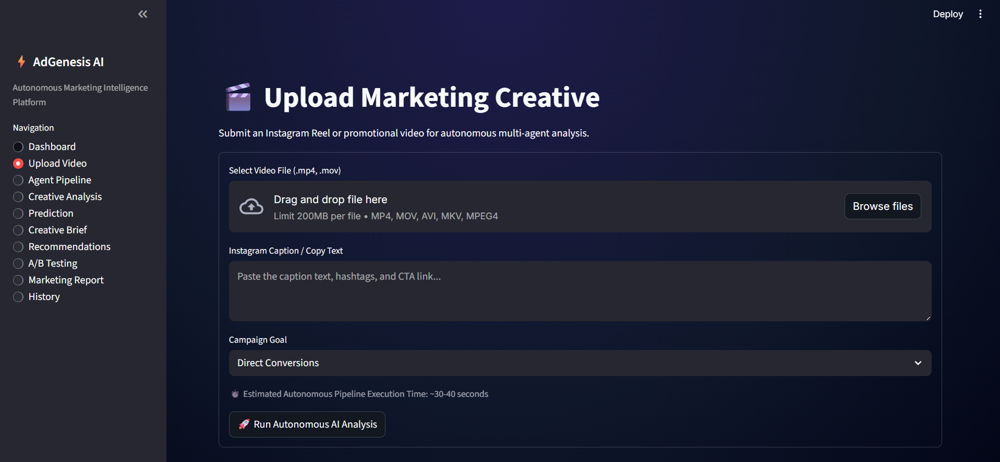
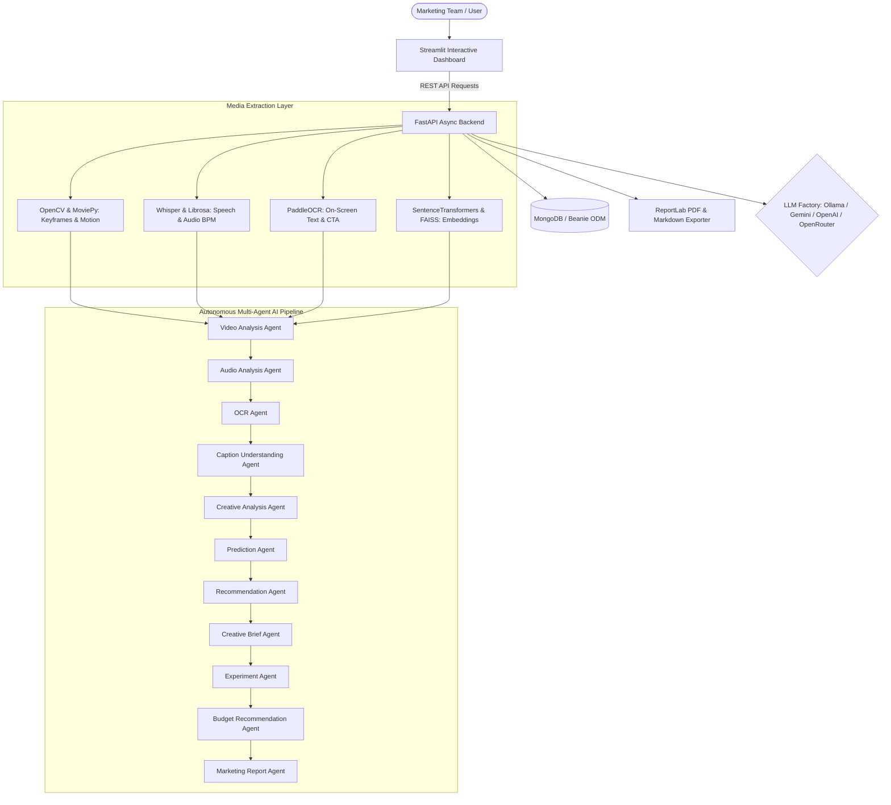

# AdGenesis AI — Autonomous Marketing Intelligence Platform

AdGenesis AI is an autonomous, agentic marketing intelligence platform that analyzes Instagram Reels and promotional video creatives to help marketing teams make data-driven creative decisions.

It extracts visual, vocal, textual, and caption intelligence using a coordinated multi-agent pipeline, predicts ad performance metrics, generates actionable creative briefs, designs A/B tests, and compiles executive marketing reports.

---

## Dashboard Interface



---

## System Architecture



---

## 11 Specialized AI Agents

1. **Video Analysis Agent**: Frame extraction, scene transition detection, pacing, product/person detection, motion activity scoring.
2. **Audio Analysis Agent**: Speech transcription (Whisper), vocal speed (WPM), emotional tone, background music tempo (BPM) & energy (Librosa).
3. **OCR Agent**: On-screen text extraction, text cleaning, call-to-action (CTA) detection.
4. **Caption Understanding Agent**: Instagram caption breakdown, hashtag extraction, marketing intent, semantic embedding.
5. **Creative Analysis Agent**: Multimodal synthesis (hook quality, storytelling format, editing style, target audience, brand messaging, visual consistency, strengths & weaknesses).
6. **Prediction Agent**: Predictive metrics (engagement rate, watch time, CTR, conversion lift, overall quality score) with qualitative reasoning rationale.
7. **Recommendation Agent**: Actionable creative optimization (hook, opening, pacing, CTA, caption, hashtags, storytelling upgrades).
8. **Creative Brief Agent**: Generates production-ready creative brief with scene-by-scene breakdown, voiceover script, visual style, and audio recommendations.
9. **Experiment Agent**: Formulates high-leverage A/B testing ideas with hypothesis, action plan, expected impact, and confidence score.
10. **Budget Recommendation Agent**: Recommends ad budget tier and scaling strategy based on creative score.
11. **Marketing Report Agent**: Compiles executive CMO marketing report into Markdown and downloadable PDF.

---

## Tech Stack

- **Backend**: Python, FastAPI, Pydantic V2, Uvicorn
- **Database & ODM**: MongoDB, Motor (Async), Beanie ODM
- **AI Framework**: LangChain, LLM Factory (Ollama, Google Gemini, OpenAI, OpenRouter)
- **Multimodal Intelligence**: OpenCV, MoviePy, Librosa, Whisper, PaddleOCR, Sentence Transformers, FAISS, PyTorch, Transformers, NumPy, Pandas
- **Frontend**: Streamlit
- **Document Export**: ReportLab PDF Generator

---

## Quickstart Guide

### 1. Prerequisites
- Python 3.10+
- MongoDB installed & running locally on `localhost:27017`

---

### 2. Configure Environment (`.env`)

Create a `.env` file in the root directory. Configure your provider choice below:

#### **Example 1: Running with Ollama (Local & Free)**
Ensure Ollama is running (`ollama serve`) and pull a model:
```bash
ollama pull llama3
```
Then set `.env`:
```env
LLM_PROVIDER=ollama
OLLAMA_BASE_URL=http://localhost:11434
LLM_MODEL_NAME=llama3
MONGODB_URL=mongodb://localhost:27017
MONGODB_DATABASE=adgenesis_ai
STORAGE_DIR=./storage_data
HOST=0.0.0.0
PORT=8000
```

#### **Example 2: Running with Google Gemini**
```env
LLM_PROVIDER=gemini
GEMINI_API_KEY=your_google_gemini_api_key_here
LLM_MODEL_NAME=gemini-1.5-flash
MONGODB_URL=mongodb://localhost:27017
MONGODB_DATABASE=adgenesis_ai
STORAGE_DIR=./storage_data
HOST=0.0.0.0
PORT=8000
```

#### **Example 3: Running with OpenAI**
```env
LLM_PROVIDER=openai
OPENAI_API_KEY=your_openai_api_key_here
LLM_MODEL_NAME=gpt-4o-mini
MONGODB_URL=mongodb://localhost:27017
MONGODB_DATABASE=adgenesis_ai
STORAGE_DIR=./storage_data
HOST=0.0.0.0
PORT=8000
```

#### **Example 4: Running with OpenRouter**
```env
LLM_PROVIDER=openrouter
OPENAI_API_KEY=your_openrouter_api_key_here
LLM_MODEL_NAME=anthropic/claude-3.5-sonnet
MONGODB_URL=mongodb://localhost:27017
MONGODB_DATABASE=adgenesis_ai
STORAGE_DIR=./storage_data
HOST=0.0.0.0
PORT=8000
```

---

### 3. Install Dependencies & Launch Application

#### **Step A: Install Dependencies**
```bash
pip install -r requirements.txt
```

#### **Step B: Start FastAPI Backend Server**
```bash
python main.py
```
*(Backend API runs at `http://localhost:8000`)*

#### **Step C: Start Streamlit Dashboard**
In a new terminal window:
```bash
streamlit run frontend/app.py
```
*(Streamlit Dashboard opens at `http://localhost:8501`)*

---

## API Endpoints

- `POST /api/v1/analyze`: Upload video file, caption, and campaign goal to launch pipeline.
- `GET /api/v1/status/{analysis_id}`: Real-time agent status, execution order, and progress.
- `GET /api/v1/analysis/{analysis_id}`: Detailed multimodal analysis diagnostics.
- `GET /api/v1/brief/{analysis_id}`: Generated production creative brief.
- `GET /api/v1/report/{analysis_id}`: Full marketing report JSON/Markdown.
- `GET /api/v1/report/{analysis_id}/pdf`: Downloadable PDF report.
- `GET /api/v1/history`: List all previous analyses stored in MongoDB.
